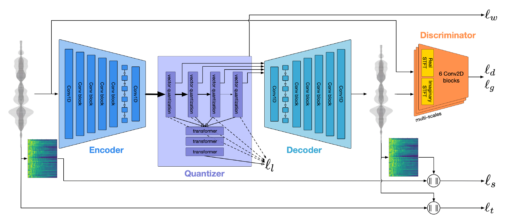
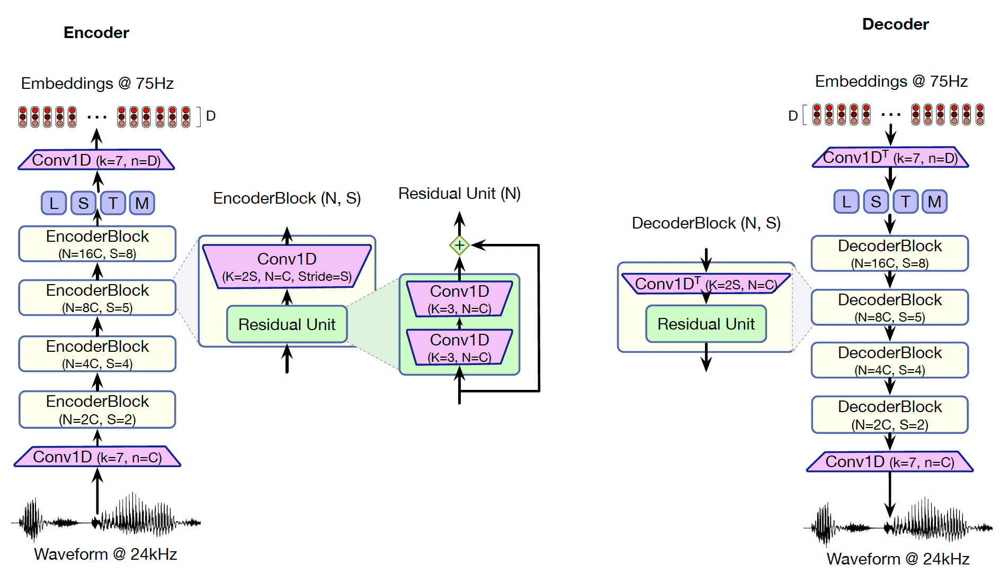
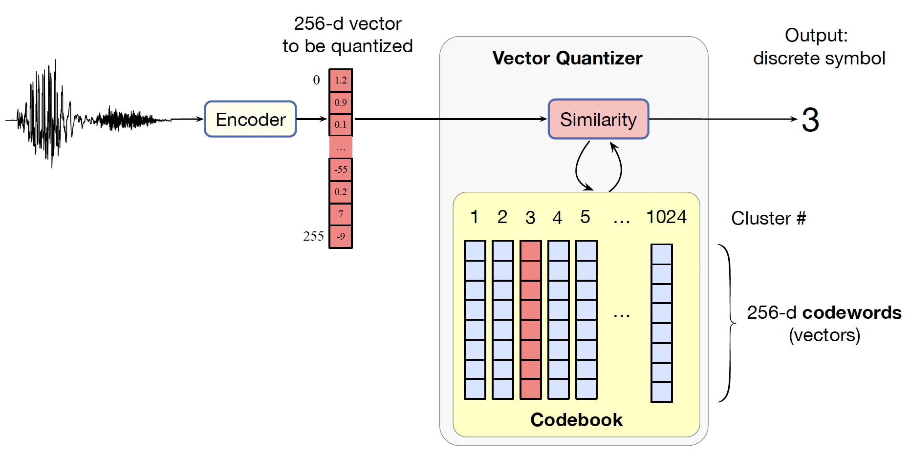
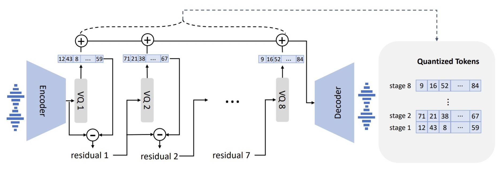
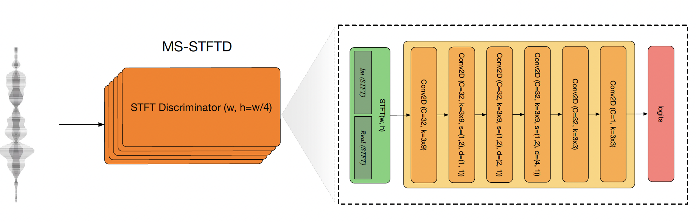

# Speech Recognition   (DSAI 456)
## Lecture 10

Mohamed Ghalwash
<Email v="mghalwash@zewailcity.edu.eg" />

---
layout: fact
---

# Recording is NOT allowed 

---
layout: top-title
---

:: title :: 

# Speech Tasks

:: content :: 

<v-clicks>

- **ASR** (Automatic Speech Recognition): maps speech to text 
- **TTS** (Text To Speech): maps text to speech (speech synthesis)
  - Zero-shot TTS. synthesis voice for **unseen** talker 
- TTS Components
  - Audio tokenizer: neural audio codecs
  - Conditional language model: generation part 

- Codec 
  - a mechanism for encoding analog speech signals into a digitized compressed representation
  - speech to digitized **tokens** (tokenizer)

</v-clicks>

---
layout: cover
class: text-center
---

# High Fidelity Neural Audio Compression
Alexandre Défossez, Jade Copet, Gabriel Synnaeve, Yossi Adi 

2023

---
layout: top-title 
class: text-center
---

:: title :: 

# EnCodec: A State-of-the-Art Real-Time Neural Codec

:: content :: 

    

---
layout: top-title
---

:: title :: 

# Motivation

:: content :: 

- EnCodec seeks to solve the challenge of achieving **very low bitrate compression with high fidelity**
  - Bitrate refers to the amount of data used per unit of time (for audio)  
  - High fidelity means the compressed data, when decompressed, minimizes the loss of sound quality

---
layout: top-title
---

:: title :: 

# EnCodec Model Architecture

:: content :: 

The system is composed of three main components, trained end-to-end:

1.  **Encoder ($E$):** Inputs audio ($x$) and outputs a latent representation ($z$)
2.  **Quantization Layer ($Q$):** Produces a compressed representation ($z_q$) using **Vector Quantization**
3.  **Decoder ($G$):** Reconstructs the time-domain signal ($\hat{x}$) from $z_q$

    

---
layout: top-title
---

:: title :: 

# Encoder/Decoder

:: content :: 

- The encoder uses 1D convolutions, residual units, down-sampling layers, and a **two-layer LSTM for sequence modeling** 
- The decoder mirrors this using transposed convolutions

    

---
layout: top-title
---

:: title :: 

# Vector Quantization

:: content ::

- Run a big set of speech wavefiles through an encoder to generate $N$ vectors, each one corresponding
to some frame of speech
- Then cluster all these $N$ vectors into $k$ clusters 
- Use iterative k-means algorithm to learn the clusters
- The codeword can be fed to the decoder
  

    

---
layout: top-title
---

:: title :: 

# Residual Vector Quantization

:: content :: 

- RVQ computes the residual after quantization and quantizes it with subsequent codebooks
- This method allows a single model to support **multiple bandwidth targets** by selecting a variable number of residual steps
- *Example:* At 24 kHz, training supports bandwidths including 1.5, 3, 6, 12, and 24 kbps

    

---
layout: top-title
---

:: title :: 

# Loss

:: content :: 

- Encoder ($E$) to RVQ ($Q$) to Decoder ($G$)
- Reconstruction losses ($\mathcal{L}_t, \mathcal{L}_f$): time and a frequency domain loss
- Adversarial losses ($\mathcal{L}_g, \mathcal{L}_d$)

    

---
layout: center
class: text-center
---

# Learn More

[Course Homepage](https://github.com/m-fakhry/DSAI-456-SR)
