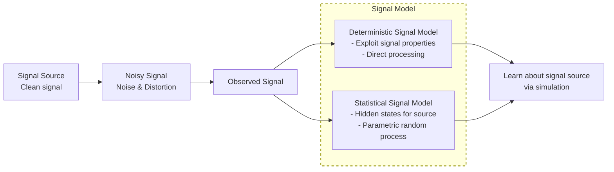
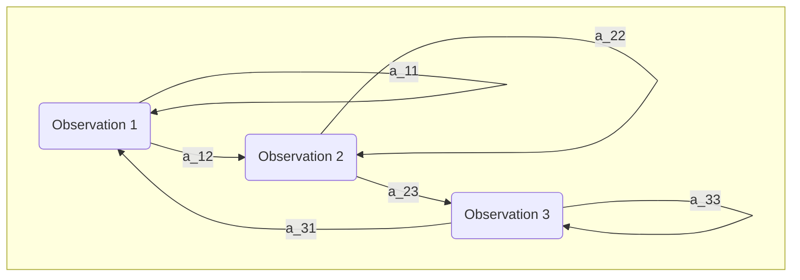
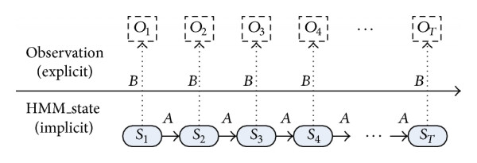
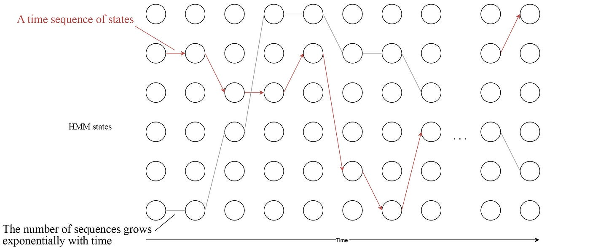

<!--  -->

# Speech Recognition   (DSAI 456)
## Lecture 5
Mohamed Ghalwash
<Email v="mghalwash@zewailcity.edu.eg" />

---
layout: top-title
---

:: title :: 

# Lecture 4 Recap 
qsqsd
:: content :: 
  
- GMM: Mixture of $k$ Gaussians
- EM algorithm 
  - Expectation: Estimate the responsibilities 
  - Maximization: Estimate the parameters of the $k$ components 
- Speaker Identification: one GMM for each speaker 

---
layout: top-title 
---

:: title :: 

# Agenda 

:: content :: 

- Motivation
- Mathematical formulation
- Fundamental Problems for HMM
- Forward algorithm 
- Using HMMs in speech recognition 

---
layout: top-title 
---

:: title :: 

# Motivation 

:: content :: 
    
**Source**: The actual phonemes or spoken words being uttered by a speaker

**Observed**: while the acoustic signal features or audio measurements recorded by a microphone.

<v-click>

- The observed signal may have noise so we need to build a signal model for the source
  - to design a system to remove noise and any transmission distortion 
  - to learn about the signal source (process that produced the signal) via simulation

</v-click>

---
layout: top-title 
---

:: title :: 

# (Observable) Markov Models

:: content :: 

- model is the set of states and transition probability matrix 
- we can compute $p(O|model)$, where $O$ is the sequence of [observation]{.decoration-4.underline.decoration-indigo-500}

---
layout: top-title 
---

:: title :: 

# Hidden Markov Models (HMM)

:: content :: 

- Double stochastic processes (one is hidden which is responsible for generating the process which is observable)

{style="margin:auto;width:100%;"}

---
layout: top-title
---

:: title :: 

# Elements of HMM

:: content :: 

{style="margin:auto;width:50%;"}

- states (hidden) $S$
- alphabets (observation symbols) $O$
- transition probability distribution $A$
- observation symbol probability (emission probability) $B$
- initial state distribution $\pi$

---
layout: top-title 
---

:: title :: 

# HMM Fundamental Problems: Speech Recognition Example

:: content :: 

<v-click at="1">

1. **[Evaluation Problem]{.decoration-4.underline.decoration-green-500}**
   - Given an HMM model for a word (states = phonemes, probabilities learned)
   - Given an observed acoustic sequence $o$ (MFCC features)
   - Compute likelihood $p(o \mid \text{model})$ that the word model generated the audio
  

<StickyNote color="green-light" textAlign="left" width="180px" v-drag="[760,125,180,80,0]">
Evaluate models on audio input to score likelihood
</StickyNote>
</v-click>

<v-click at="3">

2. **[Decoding Problem]{.decoration-4.underline.decoration-amber-500}**
   - Given model and observed audio features
   - Find most likely phoneme state sequence that produced the audio (Viterbi)

<StickyNote color="amber-light" textAlign="left" width="180px" v-drag="[740,230,180,80,0]">
Decode best phoneme path to recognize speech content
</StickyNote>
</v-click>

<v-click at="2">

3. **[Learning Problem]{.decoration-4.underline.decoration-blue-500}**
   - Given training acoustic sequences without phoneme labels
   - Estimate transition and emission probabilities to maximize data likelihood (Baum-Welch)

<StickyNote color="blue-light" textAlign="left" width="180px" v-drag="[830,320,140,100,0]">
Learn model parameters from training data to improve accuracy
</StickyNote>
</v-click>

---
layout: top-title 
---

:: title :: 

# Fundamental Problems for HMM

:: content :: 

1. **Evaluation problem**: Compute $p(o|\lambda)$ the probability of the observation sequence given the model $\lambda=\{A,B,\pi\}$
1. **Decoding problem**: Estimate the state sequence given observation sequence and the model 
1. **Learning problem**: Learn model parameters, i.e. $\argmax_{\lambda} p(o|\lambda)$
  
---
layout: cover
---

# Evaluation Problem of HMM

---
layout: top-title 
---

:: title :: 

# Evaluation Problem of HMM - Definition

:: content :: 

## Input
- Observation sequence $O = (o_1, o_2, \ldots, o_T)$
- HMM model $\lambda = (A, B, \pi)$ where
  - $A = \{a_{ij}\}$ transition probabilities
  - $B = \{b_j(o_t)=p(o_t|s_j)\}$ emission probabilities
  - $\pi = \{\pi_i\}$ initial state distribution

## Output
The likelihood $P(O \mid \lambda)$ which is the probability that model $\lambda$ produces $O$

---
layout: top-title 
---

:: title :: 

# Evaluation Problem of HMM - Direct Computation

:: content :: 

- The observation could be generated from ==any== possible state sequence $Q = (q_1, q_2, \ldots, q_T)$

<v-click>

$$
\begin{align*}
P(O \mid \lambda) &= \sum_{all \, Q} P(O, Q \mid \lambda) \\
&= \sum_{all \, Q} P(O \mid Q, \lambda)P(Q|\lambda)
\end{align*}
$$
</v-click>

<StickyNote color="red-light" textAlign="left" width="180px" v-drag="[730,220,180,100,20]">

There are $N^T$ possible state sequences
</StickyNote>

---
layout: top-title 
---

:: title :: 

# Evaluation Problem of HMM - Direct Computation

:: content :: 

<v-click>

$P(O \mid Q, \lambda) = b_{1}(o_1) \; . \; b_{2}(o_2) \; . \; b_{3}(o_3) \ldots b_{T}(o_T)$

$P(Q \mid \lambda) = \pi_1 \; . \; a_{12} \; . \; a_{23} \; . \; a_{34} \ldots a_{(T-1)T}$

Then 
$P(O, Q \mid \lambda) = \pi_{1} b_{1}(o_1) \prod_{t=2}^T a_{(t-1) t} b_{t}(o_t)$

</v-click>

 

<v-click>

- Initially we are at time 1, we are in state $q_1$ with probability $\pi_{1}$
- Generate the symbol $o_1$ with probability $b_{1}(o_1)$
- Make a transition from state $q_1$ to state $q_2$ with probability $a_{12}$
- Generate the symbol $o_2$ with probability $b_{2}(o_2)$
- Continue until the last state 

</v-click>

 

<v-click>

==There are $N^T$ possible state sequences, each requires $2T$ calculations → exponential complexity==
</v-click>

---
layout: center
color: blue
--- 

## Can we find a faster algorithm to compute the likelihood? 

---
layout: center
class: text-center
---

# Learn More

[Course Homepage](https://github.com/m-fakhry/DSAI-456-SR)
