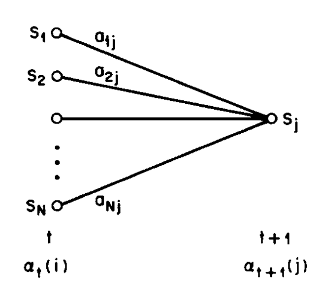

<!--  -->

# Speech Recognition   (DSAI 456)
## Lecture 6

Mohamed Ghalwash
<Email v="mghalwash@zewailcity.edu.eg" />

---
layout: top-title
---

:: title :: 

# Lecture 5 Recap 

:: content :: 
  
---
layout: top-title 
---

:: title :: 

# Agenda 

:: content :: 

- Motivation
- Mathematical formulation
- Fundamental Problems for HMM
- Forward algorithm 
- Using HMMs in speech recognition 

---
layout: center
color: blue
--- 

## Can we find a faster algorithm to compute the likelihood? 

---
layout: top-title 
---

:: title :: 

# Evaluation Problem of HMM - Forward Algorithm

:: content :: 

- A very nice trick using induction or recursive idea 
- Define probability of partial observation $o_1, o_2, \ldots o_t$ and being in state $i$ at time $t$ given $\lambda$ as 

$${0|1|3,4|6|all}
\begin{align*}
\alpha_t(i) &= P(o_1, o_2, \ldots, o_t, q_t = i \mid \lambda) \\
\Rightarrow & \\
\alpha_T(i) &= P(o_1, o_2, \ldots, o_T, q_T = i \mid \lambda) \\
&= p(O, q_T = i \mid \lambda) \\ 
\Rightarrow & \\
p(O\mid \lambda) &= \sum_{i}\alpha_T(i)  
\end{align*}
$$

<v-click> 

How to compute $\alpha_t(i)$? 
</v-click>

<v-click> 

[inductively]{style="color:red"}
</v-click>

---
layout: top-title 
---

:: title :: 

# Evaluation Problem of HMM - Forward Algorithm 

:: content ::

<v-clicks> 

- Initialization: initialize the forward probabilities as the joint probability of state $S_i$ and initial observation $O_1$

$$
\alpha_1(i) = \pi_i b_i(o_1), \quad 1 \leq i \leq N
$$

- Recursion: how state $s_j$ be reached at time $t+1$ from $N$ possible states at time $t$. Summation over all possible states $i$ at time $t$, transition to state $j$ at $t+1$, multiplied by emission probability at $t+1$

  

$$
\alpha_{t+1}(j) = \left( \sum_{i=1}^N \alpha_t(i) a_{ij} \right) b_j(o_{t+1}),
\quad 1 \leq j \leq N, \; 1 \leq t \leq T-1
$$
  

  

{style="margin:auto; width:100%;"}
  

</v-clicks> 

---
layout: top-title 
---

:: title :: 

# Evaluation Problem of HMM - Forward Algorithm 

:: content ::

<v-clicks> 

- Termination: Sum of probabilities over all states at final time

$$
P(O \mid \lambda) = \sum_{i=1}^N \alpha_T(i)
$$

- Computing $\alpha_t(i)$ using above steps enables efficient likelihood evaluation with complexity $O(N^2 T)$

</v-clicks> 

---
layout: fact
---

## Now we improved the time complexity of the likelihood evaluation $p(o\mid \lambda)$ from $N^TT$ to $N^2T$ using Forward algorithm (induction trick)

---
layout: center
class: text-center
---

# Learn More

[Course Homepage](https://github.com/m-fakhry/DSAI-456-SR)
